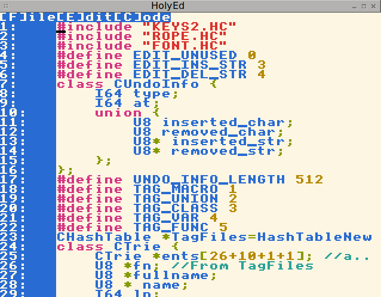

# Welcome to 3D,a HolyC compiler
This compiler contains a bounds checker and a debugger,but in order to use these you will need to enable them at the command line by using "-d" for the debugger and "-b" for the bounds checker(which will also enable the debugger). It currently comes with a runtime with compression support,though the data structures used here are type-aligned so they are not compatible with native TempleOS archives. Press `TAB` to autocomplete. There is currently no assembler support(I would rather port to other architectures than hassle with assembler)

This compiler is currently mostly a compiler,but it needs a better runtime. To get started,`#include "HolyEd/EDITOR.HC"` and use the goto-symbol function `Alt+c g or Ctrl-t` to explore the source.(you will need the compiler's source code for `HolyEd/EDITOR.HC`).

There is a `Debian_pkg.sh` and `FreeBSD_pkg.sh` for building packages for those platforms. You can use 3Days.nsi with NSIS to build an installer for windows.

# Debugger(BSAT Before Space and Time)
Start the compiler with `-d`(or `-b` for bounds checking) and call `Debugger;`

# Building
You will need yasm,gnu bison,gcc and make and sdl2. Other than that all dependencies are included in `ext/`  A modified [Oregon trail port from TinkerOS ](https://github.com/tinkeros/OT1975) is provided in the source code. Do `make installer` to make an installer for linux via `ext/epm`. This will require fltk for a graphical installer.

# Editor
This comes with a barebones editor,you can run it using `#include "HolyEd/EDITOR.HC"` Press `alt+f` to access the file menu and `alt+c` to access the code menu(Which gives a fuzzy symbol select and compile check). If you are using windows terminal you may want to change the cursor shape to a block because the background is white


# Features from TempleOS
## No variable length arrays
Array Dimensions are computed at compile time.
```
I64 dim=10;
I64 main() {
  I64 dim=100;
  I64 arr[dim]; //dim==10,we take the global;
  "DIM is %d\n",sizeof(arr)/sizeof(*arr);
}
main;
```
## Inheritance
You can use C++ Style inheritance like in TempleOS(which isn't explained well in the official docs)
```
class ABC {
  I64 a,b,c;
};
class ABC{I64 a,b,c;};
class ABCDEF:ABC {I64 d,e,f;};
ABCDEF a={1,2,3,4,5,6};
"%d,%d\n",a.a,a.d;
```
## First 64bits only
TempleOS only takes the first 64bit of any type passed to a function,so dont pass big classes as arguments
```
class {I64 first,last;} ten={10,0xffff};
"%d\n",ten;
```
## exe
This compiler is JIT so you can #exe(among other things)
```
I64 x=#exe{StreamPrint("10");};
"x:%d\n",x;
```

# Pitfalls/(and some "features")
 - This compiler will set all bytes to 0 when `MAlloc`'ed
 - Garbage collection is disabled when running HolyC code.
 - (Finer) syntax checking is done only when compiling a statement or function.
 - `#include` uses the file path scheme of the OS,so you should
 - There is no lexical scoping.
 - Like TempleOS,pointers can be nested 3 levels.
  ```
  #if IsWindows
  #include "C:\\File.HC"
  #else
  #include "/File.HC"
  #endif
  ```
 - Don't put declarations in for statements as per TempleOS
 ```
 //Dont
 for(I64 x=10;x>=0;x--) "%d\n",x;
 //Do
 I64 x;
 for(x=10;x>=0;x--) "%d\n",x;
 ```
 - Explicit typecasts are bit-for-bit. Look up IEEE754 if you use `x(F64)`,(otherwise dont typecast between F64/I64 or use `ToF64()`/`ToI64()`)
 ```
 pi==(0x400921FB54442D18(F64));
 I64 int_pi=ToI64(pi);
 ```
# Assembler
This compiler includes an assembler,see `asmtest.hc` for usage. All functions are placed in the first 32 bits of memory,so you should be able to jump to them if you import them. **However the case isn't the same for global variables,load their pointer into a register before addressing them**(Most memory operations use 32bit offsets,see `MOFFSxx` in `HCRT/Opcodes.DD` if you really want to.).
```
U0 Hi() {
 asm {
	 IMPORT Hello;
	 CALL Hello;
 }
}
```
If you suspect the assembler is acting up,open in gdb and type `disas GetVariable("Func_with_asm_in_it").func.funcptr,+100` for a dissambly. I would love to fix any problems in the assembler. Also,make sure you follow the ABI for your OS when using assembler code. And **DONT JUMP INTO ASM BLOCKS FROM HolyC Code**. All registers are unloaded prior to entering an asm block and before any label that an asm block jumps to.


# Internals
This compiler uses a modified myjit which runs under windows(new feature),linux(and breifly tested on FreeBSD). The main part of the Compiler is in compile.c. The compiler uses a value stack for temporary values(if they are on the stack on the same time they interfere). The grammar is in `HolyC.y`. The lexer uses a rope data structure provided by a patched `ext/mropes`.  I plan on making a game with this compiler so I will add to the runtime as needed. If you want to add functions,look at `runtime.c`,but a functional text editor is provided in `HolyEd/EDITOR.HC`.

# Contributing
You can contribute by adding to the runtime(see `runtime.c` and `HCRT/`).  Nice things would include:

 - A fltk binding
 - A DolDoc engine on top of said binding
 - A Holy Bible API and such
 - Make a `Help` function.

# Credits
 - https://github.com/martincohen/x64
 - https://github.com/ruimaciel/mropes
 - http://myjit.sourceforge.net/index.htm
 - https://github.com/rxi/map
 - https://github.com/rxi/vec
 - C_Unescaper(me nrootconauto@gmail.com)
 - https://github.com/argtable/argtable3
 - https://jimjag.github.io/epm/
 - https://pdcurses.org/
 - https://sourceforge.net/projects/mingweditline/
