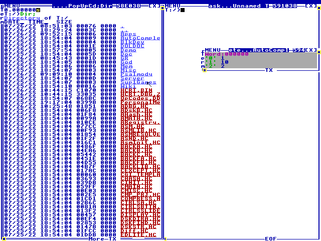
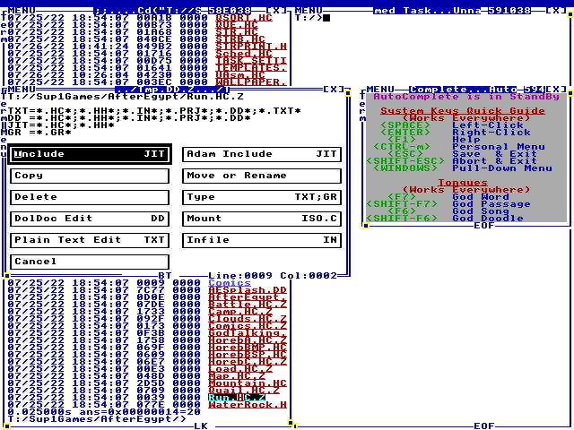
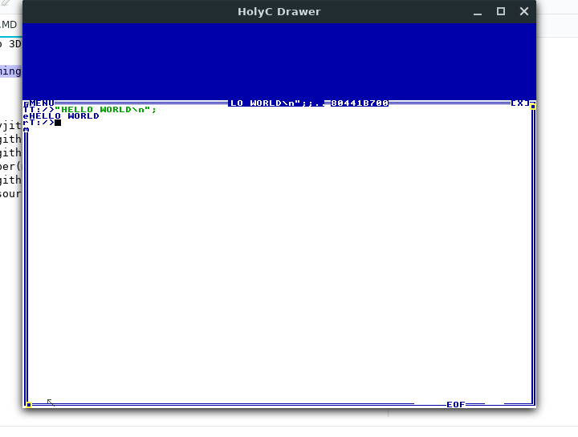

# Welcome to 3Days,a HolyC compiler
Welcome to 3Days,a HolyC Compiler for FreeBSD and Windows.

This contains a port of the TempleOS compiler from the original sources of TempleOS,along with other things like the DolDoc engine and Gr stuff.
To get started,you will need `tcsh`,`libX11`, and `gcc` to build the stuff,which you can do by typing `make` on linux and `gmake` on FreeBSD.

# Development
This compiler has had a long history,it started out being written in C/yacc. I wasn't pleased with it so i rewrote it in HolyC. After I had a working HolyC compiler,I ported the TempleOS compiler to run under FreeBSD,which led to an easy port of the DolDoc engine
All depencies (except for X11 on unix) are included with this repo so building should not be a problem. 

To build the compiler binary `HCRT.BIN`,type `Cmp("FULL_PACKAGE.HC","HCRT.DBG.Z","HCRT.BIN");` in 3Days in the root directory of `T:`
There is a booting process though, `KERNELA.HH` contains the functions that aren't linked to assembler symbols,but `KERNELB.HH` contains functions linked to assembler symbols. They are loaded in `FULL_PACKAGE.HC`
 

# HolyC Caveats
## 1: Lvalues can be typecasted
```c
U8 *x=NULL;
x(I64*)++;
x==8; //I64 is 8 bytes wide
```
## 2: Inheritance
```c
class abc {
    I64 a,b,c;
};
class abcdef:abc {
    I64 d,e,f;
};
abcdef six={'a','b','c','d','e','f'};
```
## 3: Weird for statements
Dont put declarations in for statements
```c
for(I64 dont_do=0;;dont_do++) //Invalid code
    ...;
```
Instead do this
```c
I64 x=0;
for(x=0;x!=10;x++)
    "%d\n",x;
```

# Getting Started
Welcome to the world of TempleOS,you should see 2 terminals. You can type into them for fun. Try typing `Dir;` to get a directory listing. You will probably see the (HolyC) source files for 3Days. 



TempleOS allows you to click the files or folders. Try clicking `Sup1Games` or `Cd("Sup1Games");`to go into a folder and type `Dir;` to see the contents.

Inside the directory you should see `AfterEgypt`,in that folder should be lots of files. You can run of file by `#include "Run.HC.Z"` or by right clicking it and pressing the include button(left clicking will open it's source code in a editor). 



# Tips
 * You can press `ctrl+m` to get the personal menu,this will give you some links(not all are implemented at the moment).

# Screenshot


# Credits
 - https://github.com/rxi/map
 - https://github.com/rxi/vec
 - C_Unescaper(me nrootconauto@gmail.com)
 - https://github.com/argtable/argtable3
 - https://github.com/futurist/CommandLineToArgvA
